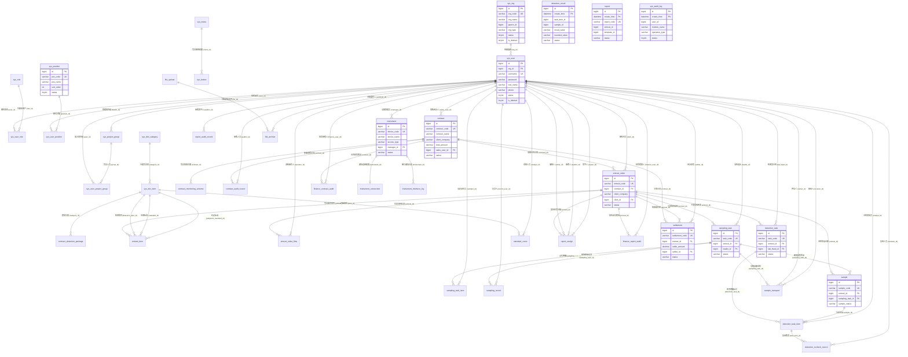

# LIMS 实验室信息管理系统 - 全表 ER 关系图

```mermaid
erDiagram
    %% --------------------------------------------------------
    %% 1. lims-system 模块
    %% --------------------------------------------------------
    sys_org ||--o{ sys_user : "所属组织 (org_id)"
    sys_user ||--o{ sys_user_role : "拥有角色 (user_id)"
    sys_role ||--o{ sys_user_role : "分配给用户 (role_id)"
    sys_user ||--o{ sys_user_position : "担任岗位 (user_id)"
    sys_position ||--o{ sys_user_position : "职位分配 (position_id)"
    sys_user ||--o{ sys_project_group : "管理项目组 (leader_id)"
    sys_user ||--o{ sys_user_project_group : "加入项目组 (user_id)"
    sys_project_group ||--o{ sys_user_project_group : "包含人员 (group_id)"
    sys_menu ||--o{ sys_button : "包含按钮权限 (menu_id)"
    sys_dict_category ||--o{ sys_dict_item : "分类包含项 (category_id)"

    %% --------------------------------------------------------
    %% 2. lims-contract 模块
    %% --------------------------------------------------------
    sys_user ||--o{ contract : "销售经办人 (sales_user_id)"
    contract ||--o{ contract_monitoring_scheme : "包含监测方案 (contract_id)"
    contract ||--o{ contract_audit_record : "多级审核记录 (contract_id)"
    sys_user ||--o{ contract_audit_record : "审核人员 (auditor_id)"
    sys_dict_item ||--o{ contract_detection_package : "套餐分类 (category_id)"

    %% --------------------------------------------------------
    %% 3. lims-entrust 模块
    %% --------------------------------------------------------
    contract ||--o{ entrust_order : "依据合同立项 (contract_id)"
    sys_user ||--o{ entrust_order : "接样专员 (clerk_id)"
    entrust_order ||--o{ entrust_item : "包含委托项目 (entrust_id)"
    sys_dict_item ||--o{ entrust_item : "检测项目 (detection_item_id)"
    sys_dict_item ||--o{ entrust_item : "检测标准 (standard_id)"
    sys_dict_item ||--o{ entrust_item : "判定标准 (judgment_standard_id)"
    entrust_order ||--o{ entrust_order_flow : "状态流转轨迹 (entrust_id)"
    sys_user ||--o{ entrust_order_flow : "流转操作人 (operator_id)"

    %% --------------------------------------------------------
    %% 4. lims-sampling 模块
    %% --------------------------------------------------------
    entrust_order ||--o{ sampling_task : "派发现场采样 (entrust_id)"
    sys_user ||--o{ sampling_task : "采样组长 (leader_id)"
    sampling_task ||--o{ sampling_task_item : "点位明细 (sampling_task_id)"
    sys_user ||--o{ sampling_task_item : "指定采样员 (sampler_id)"
    sampling_task ||--o{ sampling_record : "现场原始记录 (sampling_task_id)"
    sys_user ||--o{ sampling_record : "记录人 (record_user_id)"
    entrust_order ||--o{ sample : "送样样品台账 (entrust_id)"
    sampling_task ||--o{ sample : "现场采样样品 (sampling_task_id)"
    sampling_task ||--o{ sample_transport : "冷链运输送样 (sampling_task_id)"
    sys_user ||--o{ sample_transport : "押运人 (carrier_id)"
    sys_user ||--o{ sample_transport : "接收人 (receiver_id)"

    %% --------------------------------------------------------
    %% 5. lims-detection 模块
    %% --------------------------------------------------------
    entrust_order ||--o{ detection_task : "下发实验任务 (entrust_id)"
    sys_user ||--o{ detection_task : "检测室主任 (lab_head_id)"
    detection_task ||--o{ detection_task_item : "任务明细派工 (detection_task_id)"
    sample ||--o{ detection_task_item : "分析样品 (sample_id)"
    sys_user ||--o{ detection_task_item : "主检实验员 (analyst_id)"
    sys_dict_item ||--o{ standard_curve : "对应项目 (item_id)"
    sys_user ||--o{ standard_curve : "绘制人员 (analyst_id)"
    detection_task_item ||--o{ detection_recheck_record : "复审核查 (task_item_id)"
    sys_user ||--o{ detection_recheck_record : "复审人员 (reviewer_id)"
    %% 业务关联：detection_result 关联 task_item, sample, instrument, curve

    %% --------------------------------------------------------
    %% 6. lims-report 模块
    %% --------------------------------------------------------
    entrust_order ||--o{ report_assign : "报告任务分配 (entrust_id)"
    sys_user ||--o{ report_assign : "编制人 (writer_id)"
    sys_user ||--o{ report_assign : "审核人 (auditor_id)"
    sys_user ||--o{ report_assign : "签字人 (signer_id)"
    sys_user ||--o{ report_audit_record : "审核签字人 (auditor_id)"
    %% 业务关联：report 关联 entrust_order, contract, report_template

    %% --------------------------------------------------------
    %% 7. lims-finance 模块
    %% --------------------------------------------------------
    contract ||--o{ finance_contract_audit : "合同财务核定 (contract_id)"
    sys_user ||--o{ finance_contract_audit : "财务审核人 (finance_user_id)"
    entrust_order ||--o{ finance_report_audit : "报告出具核验 (entrust_id)"
    sys_user ||--o{ finance_report_audit : "财务核算人 (finance_user_id)"
    contract ||--o{ settlement : "关联合同 (contract_id)"
    entrust_order ||--o{ settlement : "结算委托单 (entrust_id)"
    sys_user ||--o{ settlement : "经办财务 (settler_id)"

    %% --------------------------------------------------------
    %% 8. lims-device 模块
    %% --------------------------------------------------------
    sys_user ||--o{ instrument : "设备管理员 (manager_id)"
    instrument ||--o| instrument_connection : "通信连接配置 (instrument_id)"
    instrument ||--o{ instrument_interface_log : "接口通信日志 (instrument_id)"

    %% --------------------------------------------------------
    %% 9. lims-file 模块
    %% --------------------------------------------------------
    file_upload ||--o{ file_archive : "归档原始文件 (file_id)"
    sys_user ||--o{ file_archive : "归档操作人 (archivist_id)"

    %% --------------------------------------------------------
    %% 表结构核心字段
    %% --------------------------------------------------------
    sys_org {
        bigint id PK
        varchar org_code UK
        varchar org_name
        bigint parent_id
        varchar org_type
        tinyint status
        tinyint is_deleted
    }

    sys_user {
        bigint id PK
        bigint org_id FK
        varchar username UK
        varchar password
        varchar real_name
        varchar phone
        tinyint status
        tinyint is_deleted
    }

    sys_position {
        bigint id PK
        varchar pos_code UK
        varchar pos_name
        int sort_order
        tinyint status
    }

    contract {
        bigint id PK
        varchar contract_code UK
        varchar contract_name
        varchar client_company
        decimal total_amount
        bigint sales_user_id FK
        varchar status
    }

    entrust_order {
        bigint id PK
        varchar entrust_code UK
        bigint contract_id FK
        varchar client_company
        bigint clerk_id FK
        varchar status
    }

    sampling_task {
        bigint id PK
        varchar task_code UK
        bigint entrust_id FK
        bigint leader_id FK
        varchar status
    }

    sample {
        bigint id PK
        varchar sample_code UK
        bigint entrust_id FK
        bigint sampling_task_id FK
        varchar sample_status
    }

    detection_task {
        bigint id PK
        varchar task_code UK
        bigint entrust_id FK
        bigint lab_head_id FK
        varchar status
    }

    detection_result {
        bigint id PK
        datetime create_time PK
        bigint task_item_id
        bigint sample_id
        varchar result_value
        varchar rounded_value
        varchar status
    }

    report {
        bigint id PK
        datetime create_time PK
        varchar report_code UK
        bigint entrust_id
        bigint template_id
        varchar status
    }

    settlement {
        bigint id PK
        varchar settlement_code UK
        bigint entrust_id FK
        decimal settle_amount
        bigint settler_id FK
        varchar status
    }

    instrument {
        bigint id PK
        varchar device_code UK
        varchar device_name
        varchar access_type
        bigint manager_id FK
        varchar status
    }

    sys_audit_log {
        bigint id PK
        datetime create_time PK
        bigint user_id
        varchar module_name
        varchar operation_type
        tinyint status
    }
```
