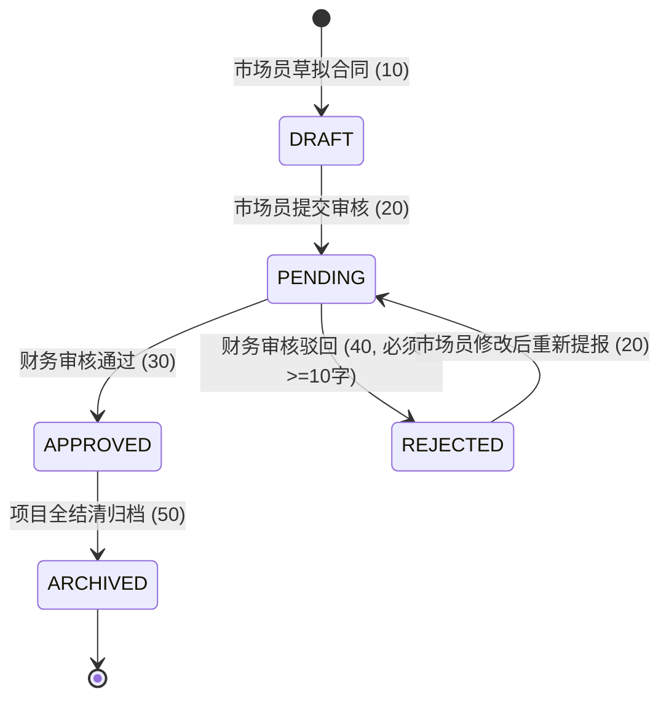
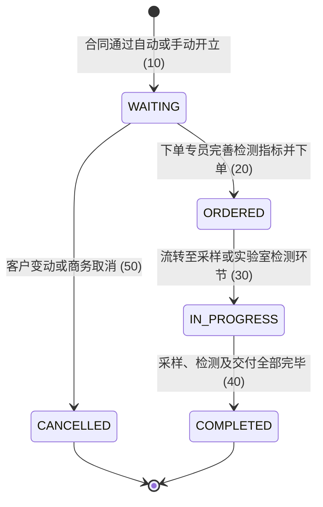
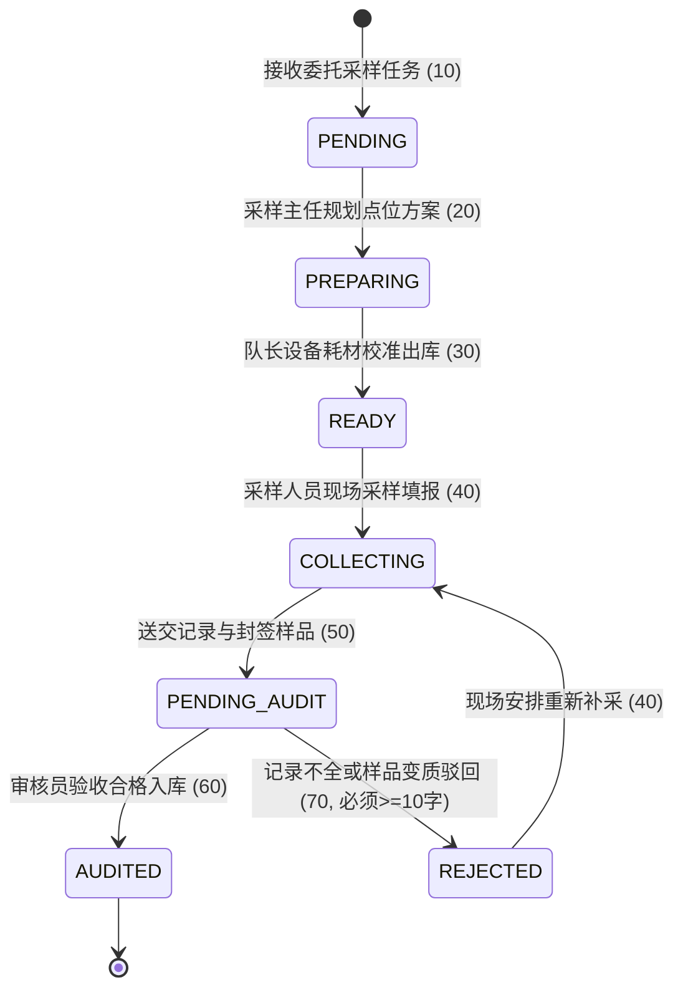
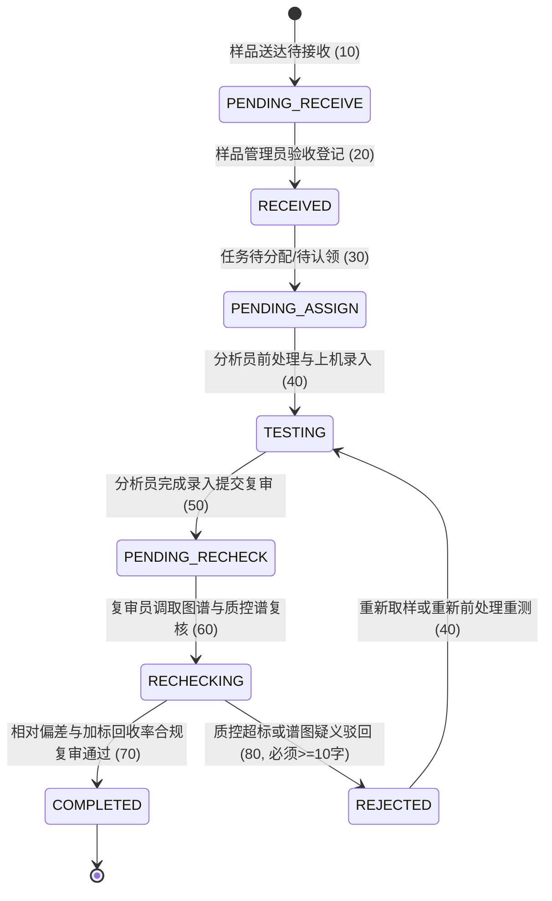
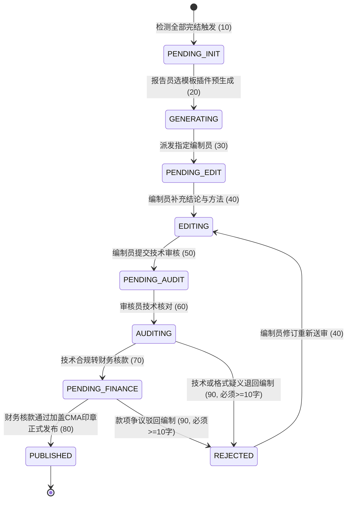
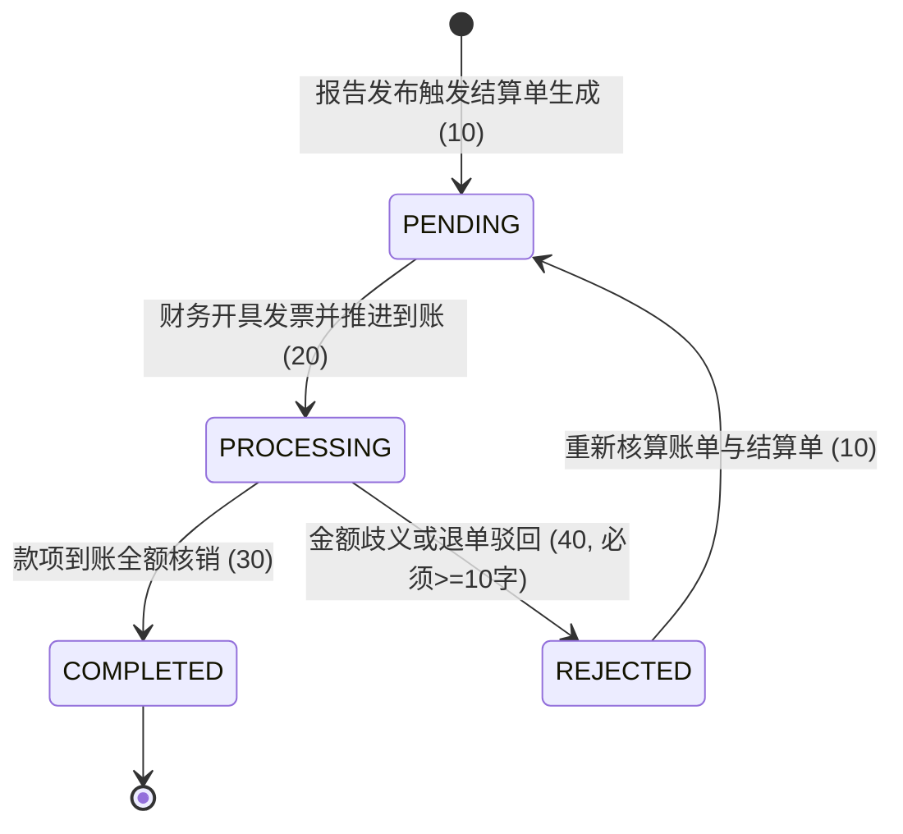

# LIMS 六大阶段工作流与状态机设计规范 (Flowable 7.0)

本文档定义了遵循 **GB/T 27025-2019** 与 **ISO/IEC 17025** 国际认证标准的 LIMS 核心六大业务阶段全生命周期状态机模型、Flowable BPMN 2.0 拓扑建模、阶段内驳回与任意回退机制以及全链路审计留痕规则。

---

## 一、六大业务阶段状态流转与 Mermaid 状态机模型

### 1. 阶段一：合同登记与审核 (Contract)
- **业务流程**：市场员登记合同 → 提交待审 → 财务审核 → （审核通过转已审核 / 驳回修改重新提报） → 归档。
- **操作职位**：市场员（`SALES_REP`）、财务审核（`FINANCE_SPECIALIST`）。



### 2. 阶段二：委托下单 (Entrust)
- **业务流程**：下单专员基于已通过合同建立委托单 → 设定检测方法与指标要求 → 下达执行或主动撤回取消。
- **操作职位**：下单专员（`ORDER_SPECIALIST`）。



### 3. 阶段三：采样管理 (Sampling)
- **业务流程**：采样主任编制方案 → 采样队长准备物料设备 → 现场采样与环境参数填报 → 采样记录审核员审核（不合格驳回重采）。
- **操作职位**：采样主任（`SAMPLING_DIRECTOR`）、采样队长（`SAMPLING_CAPTAIN`）、采样员（`SAMPLING_OFFICER`）、采样记录审核员（`SAMPLING_AUDITOR`）。



### 4. 阶段四：检测分析 (Detection)
- **业务流程**：样品管理员接收入库 → 主任分发/认领 → 分析员前处理与仪器上机 → 录入结果与质控数据 → 复审人员核验（质控不合格驳回重测）。
- **操作职位**：样品管理员（`SAMPLE_ADMIN`）、实验室主任（`LAB_DIRECTOR`）、分析员（`ANALYST`）、实验数据复审人员（`DATA_REVIEWER`）。



### 5. 阶段五：报告编制与审核 (Report)
- **业务流程**：报告员发起并选模板 → 插件渲染生成 → 编制员编制结论 → 技术审核员技术签核 → 财务确认账款 → 电子印章盖章正式发布。
- **操作职位**：报告专员（`REPORT_SPECIALIST`）、编制员（`REPORT_WRITER`）、审核员（`REPORT_AUDITOR`）、财务人员（`FINANCE_SPECIALIST`）。



### 6. 阶段六：财务结算 (Settlement)
- **业务流程**：报告发布后生成结算单 → 财务专员开票核算 → 核验银行进账流水核销 → 已结算完毕。
- **操作职位**：财务专员（`FINANCE_SPECIALIST`）。



---

## 二、驳回与回退规则矩阵

| 业务阶段 | 驳回/回退动作 | 触发源节点 | 目标目标节点 | 权限校验（岗位/权限字符） | 约束要求 |
| :--- | :--- | :--- | :--- | :--- | :--- |
| **合同** | 阶段内驳回 | 财务审核 (`task_finance_audit`) | 市场员修改 (`task_sales_modify`) | `FINANCE_SPECIALIST` / `contract:reject` | 必填原因（≥10字），记录到 `process_reject_record` |
| **合同** | 动态回退 | 财务审核 / 任意后续节点 | 流程内任意上游已完成活动 | `SUPER_ADMIN` / `contract:rollback` | 必填原因（≥10字），Flowable 状态强切 |
| **委托** | 委托取消 | 开具委托单 (`task_create_order`) | 结束事件 (`endEvent_cancelled`) | `ORDER_SPECIALIST` / `entrust:reject` | 必填原因（≥10字） |
| **采样** | 记录审核驳回 | 采样审核 (`task_sampling_audit`) | 现场重新采样 (`task_resampling`) | `SAMPLING_AUDITOR` / `sampling:reject` | 必填原因（≥10字），记录原样品报废编号 |
| **采样** | 任意回退 | 采样审核 (`task_sampling_audit`) | 耗材准备 (`task_material_prepare`) | `SAMPLING_DIRECTOR` / `sampling:rollback` | 必填原因（≥10字） |
| **检测** | 质控复审驳回 | 数据复审 (`task_data_recheck`) | 重新检测 (`task_retesting`) | `DATA_REVIEWER` / `detection:reject` | 必填原因（≥10字），必须注明偏差指标 |
| **检测** | 样品回退 | 实验前处理 (`task_do_testing`) | 样品接收登记 (`task_sample_receive`) | `LAB_DIRECTOR` / `detection:rollback` | 必填原因（≥10字），说明接收有误 |
| **报告** | 技术审核驳回 | 审核员审核 (`task_report_audit`) | 报告编制 (`task_report_edit`) | `REPORT_AUDITOR` / `report:reject` | 必填原因（≥10字），指出具体图表错误 |
| **报告** | 财务审核驳回 | 财务账款核查 (`task_finance_check`)| 报告编制 (`task_report_edit`) | `FINANCE_SPECIALIST` / `report:reject` | 必填原因（≥10字），注明欠费或合同条款有误 |
| **结算** | 金额异议驳回 | 到账核销 (`task_settlement_confirm`)| 开立结算单 (`task_settlement_create`)| `FINANCE_SPECIALIST` / `finance:reject` | 必填原因（≥10字），重新核算金额 |

---

## 三、Flowable BPMN 建模关键架构决策

1. **UserTask 候选组绑定（CandidateGroups）**：
   - 拒绝在流程图中使用硬编码用户ID，统一绑定岗位编码（如 `FINANCE_SPECIALIST`, `SAMPLING_OFFICER`），与 `sys_position.code` 一一映射。
   - 任务认领与查询时，结合 Sa-Token 当前登录用户的职位列表（`StpUtil.getRoleList()`）进行动态任务拉取。

2. **阶段内驳回与动态回退实现方案**：
   - **方案一（模型内驳回）**：对于常见的审核失败重做（如财务驳回市场员、复审驳回重测），在 BPMN 中内建排他网关 `ExclusiveGateway` + 条件连线（`${auditPass == false}`），业务流程天然闭环清晰。
   - **方案二（动态任意回退）**：利用 Flowable 7.x 提供的运行时命令：
     ```java
     runtimeService.createChangeActivityStateBuilder()
         .processInstanceId(processInstanceId)
         .moveActivityIdTo(currentActivityId, targetActivityId)
         .changeState();
     ```
     支持跨网关、跨历史节点的跳跃式回退，无需在 BPMN 图中连满蜘蛛网般的复杂连线。

3. **跨阶段解耦与全链路数据串联（ProcessBusinessRelation）**：
   - 每个业务阶段采用独立的流程定义（6 个 Process Definition），避免一个超长流程图导致维护困难与死锁。
   - 通过独立的中间表 `process_business_relation`（记录 `business_key`, `stage`, `process_key`, `process_instance_id`, `status`），将同一合同衍生出的各个业务阶段流程串联成一棵完整的业务树，实现跨流程聚合查询与回退。

4. **合规审计与可追溯性（ISO 17025 要求）**：
   - 强制将 Flowable 历史级别设置为 `history-level: full`，保证保留节点流转、表单参数、执行时间至少 5 年以上。
   - 核心驳回/回退操作双重留痕：写入 `sys_audit_log`（系统全局日志）以及专门的业务审计表 `process_reject_record`。
